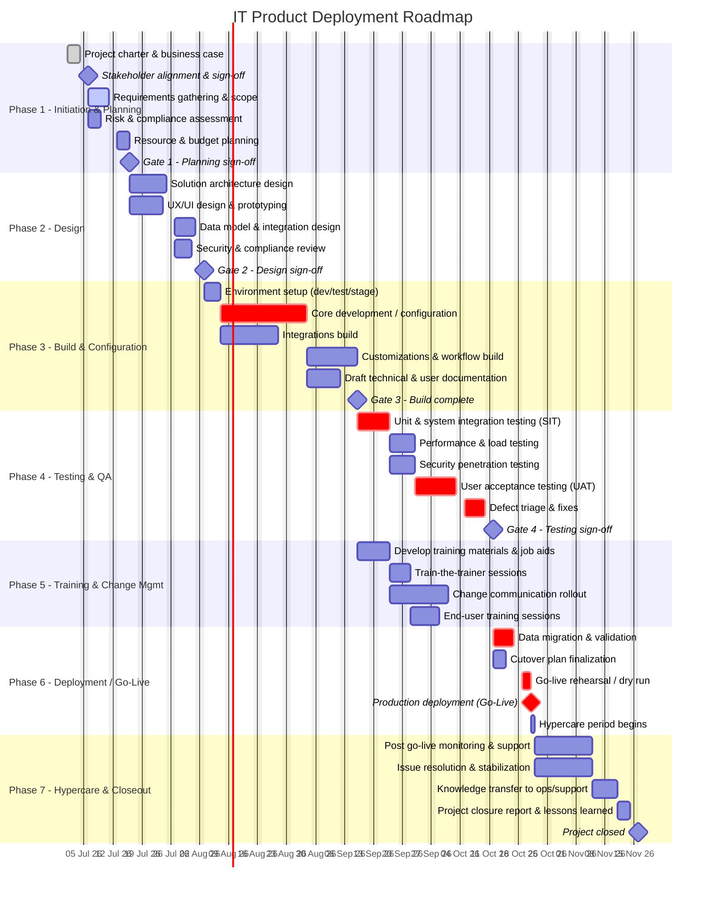

# IT Product Deployment — Gantt Chart

> Rendered automatically by GitHub (no extension needed) because it uses a fenced ```mermaid``` block.
> The axis (`axisFormat %d %b %y`) shows day, month, and year together on every tick, and `tickInterval 1week` keeps weekly gridlines visible even when zoomed out to a multi-month view. Extend any phase's duration and the plan will naturally run past a year boundary — the axis format handles that without changes.

Edit the **one** absolute date below (`p1_charter` start date) to shift the entire plan — every other task is defined relative to it via `after <id>`, so Mermaid recalculates the whole schedule for you.



## How to read this

| Mermaid concept | Maps to |
|---|---|
| `section` | A **phase** (top-level task) |
| Bar within a section | A **subtask** of that phase |
| `after <id>` | A **dependency** on one or more other tasks/subtasks |
| `milestone` | A **gate/sign-off** (zero-duration checkpoint) |
| `crit` | Marks items on the **critical path** (rendered in red) |
| `done` / `active` | Status styling — update these tags as work progresses |

## Customizing

- **Change the timeline**: edit the single date on `p1_charter` (`2026-07-01`). Everything downstream shifts automatically.
- **Add a task**: add a line under the right `section`, give it a unique `id`, and point its `after` at whatever it depends on.
- **Add a subtask under a subtask**: Mermaid only supports two levels (section → task). For deeper hierarchies, use the `Parent ID` column in [tasks.csv](tasks.csv) instead, and/or GitHub's native **sub-issues** feature (see [docs/github-project-setup.md](docs/github-project-setup.md)).
- **Track real status**: swap `done` / `active` tags in, as tasks complete, so the chart visually reflects progress — this file is meant to be edited and re-committed throughout the project, not generated once and frozen.

For day-to-day task tracking (assignees, comments, Kanban board, live status) use the **GitHub Project** described in [docs/github-project-setup.md](docs/github-project-setup.md) — this Mermaid chart is the always-current visual summary that lives next to your code/docs and needs no external tool.
